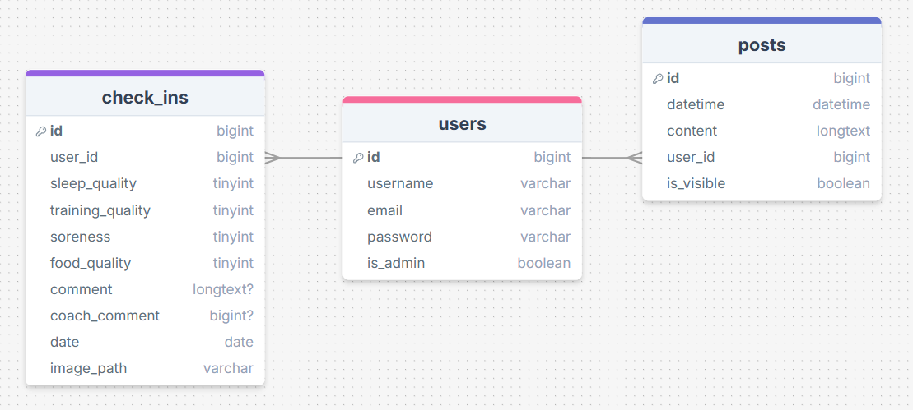

# Userstories

Gebruiker = klant
 - Als gebruiker wil ik kunnen inloggen/registreren om in mijn persoonlijke omgeving te komen
 - Als gebruiker wil ik dagelijks een check-in kunnen insturen met mijn gegevens van die dag
 - Als gebruiker wil ik feedback van een coach terug kunnen zien.

Coach = Admin
 - Als Coach wil ik een overzicht van al mijn klanten kunnen zien
 - Als Coach wil ik per klant de check-in kunnen inzien
 - Als coach wil ik een reactie kunnen achterlaten op iemand zijn check-in
 - Als coach wil ik een globaal bericht kunnen posten om al mijn klanten op de hoogte te brengen van de laatste nieuwtjes

## Dinsdag 21/10/2025
 - Project (alweer) opnieuw moeten opzetten door fout die ik niet wist op te lossen
 - Repo aangemaakt
 - Changelog aangemaakt
 - Userstories/ERD toegevoegd
 
planning voor morgen:
    - migrations, layout, nav bar en login/register

## Woensdag 22/10/2025
 - Migrations gemaakt
 - login/register van breeze werkte niet, hierdoor alweer een nieuw project aangemaakt. Hij deed het toen nog steeds niet maar dit kwam uiteindelijk omdat ik https niet aan had gezet in herd. Nu kan ik dus eindelijk aan de slag.

## Donderdag 23/10/2025
 - Login/register home pagina gemaakt
 - Nav bar layout gemaakt
 - Nav-link components gemaakt
 - views/routes aangemaakt voor een aantal benodigde pagina's

## Zaterdag 25/10/2025
- check in opsturen gemaakt
- check in geschiedenis gemaakt met detailpagina - dit wordt ook weer belangrijk als de admin kant komt. 
- Routes goed gezet door te verwijzen naar een controller.
- Authenticatie toegvoegd aan pagina's en het inzien van checkins.